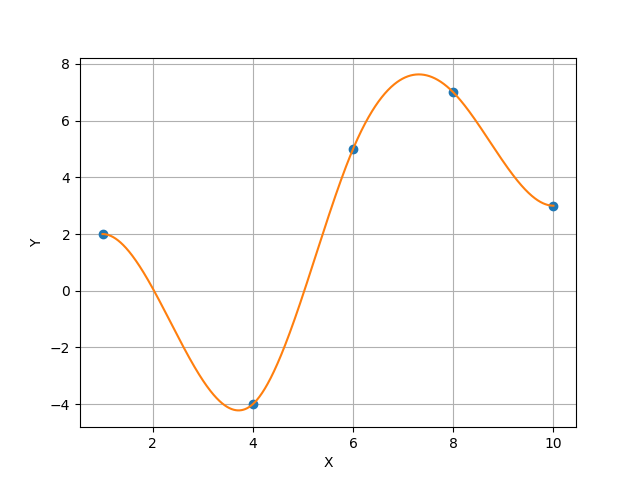
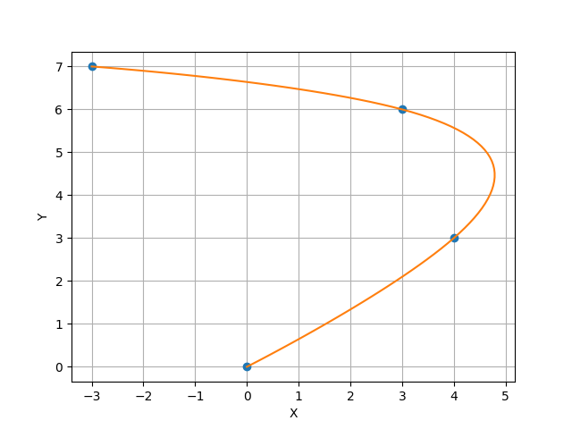

# Cubic Spline Interpolation Project

Python library project that implements the cubic spline interpolation between a given set of points. The interpolation coefficients are computed using an LU Decomposition and a Tridiagonal Linear System Solver Algorithm, both implemented within the project.

## Structure
Each of the three algorithms is implements in its own file, inside the folder `code`.  

File `lu.py`  contains the algorithm for the LU Decomposition. The algorithm take as input three `numpy.array` representing the main diagonal and the two adjacient diagonals of the matrix
File `tls.py` contains the implementation of forward and backward algorithm, splitted into functions `backward` e `forward`, respectively; in addition the function `solver`, wraps the two previous fuctions in the correct order so that the tridiagonal linear system associated with the input arrays is correctly solved.
Lastly, file `spline.py`  contains the implementation of an object `CubicSpline`; it has a constructor, inside which the interpolation coefficients are computed and an `eval` method, which allow to compute the value of the spline for a given set of points betwenn the initial and final node. 

Each file implements its own set of exception.

## Download e Utilizzo

Dowload the repository
```
git clone https://github.com/GianMarcoCoppari/cubicspline.git
```
so that you can use it directly from the terminal or inside a python script. In both cases you must run the python code from the inside of the `code` folde.


### Routine di Test

Tests have been written and run using `unittest` and `coverage` libraries, using the commands
```
coverage run .\lu_test.py
coverage html
```
to check that the code was fully tested. The html page in which the output of the coverage test is written can be accessed using the line command `.\htmlcov\index.html`. In a similar way the test files `tls_test.py` and `spline_test.py` were run.

Type hints have been tested using `mypy` library.


## Features

The main aim of the prject is to compute a cubic spline, startinf from a given set of nodes.
Beside this, the project is also capable, by construction, of 

 - factorizing tridiagonal matrices using the LU decomposition algorithm.
 - sovle tridiagonal linear systems
 - compute cubic splines in two sptial dimensions.

## Example
Examples of how to use the library.
For a unidimensional spline, the following code 
```
import  numpy  as  np
import matplotlib.pyplot as plt
import spline

X   =  np.array([1, 4, 6, 8, 10])
Y   =  np.array([2, -4, 5, 7, 3])
BC  =  np.array([0, 0])
cspline  =  spline.CubicSpline(X, Y, BC)


nsamples  =  100
x  =  np.linspace(X[0], X[-1], nsamples)

plt.plot(X, Y, 'o')
plt.plot(x, cspline.eval(x))

plt.grid(True)
plt.xlabel("X")
plt.ylabel("Y")

plt.show()
```
produce the following output.


For a spline in two dimensions one can write
```
import numpy as np
import matplotlib.pyplot as plt
import spline

t  = np.array([0, 1, 2, 3], dtype = np.float64)
X  = np.array([0, 4, 3, -3], dtype = np.float64)
Y  = np.array([0, 3, 6, 7], dtype = np.float64)
BC = np.array([0, 0], dtype = np.float64)

xspline = spline.CubicSpline(t, X, BC)
yspline = spline.CubicSpline(t, Y, BC)

nsamples = 100
time = np.linspace(t[0], t[-1], nsamples)

plt.grid(True)
plt.xlabel("X")
plt.ylabel("Y")

plt.plot(X, Y, 'o')
plt.plot(xspline.eval(time), yspline.eval(time))
plt.show()

```
to produce the following result.

